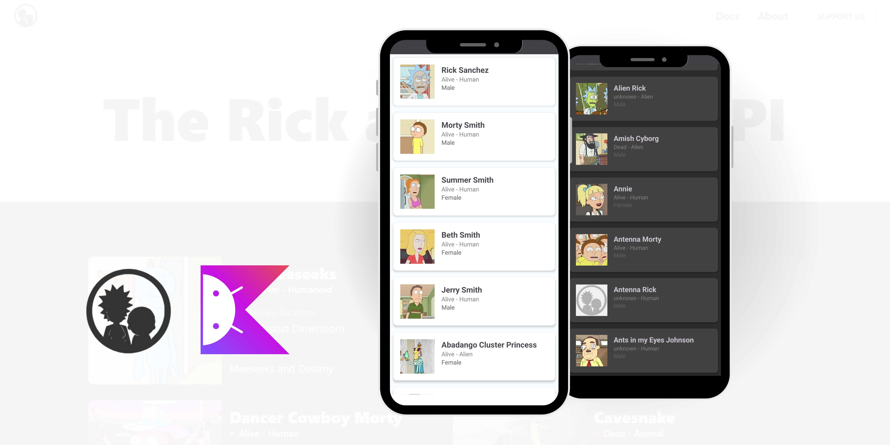

##

### Rick and Morty Character App

## 📙 Description

Rick and Morty Character App is a simple mobile application designed to display character data from the popular cartoon Rick and Morty. This application fetches data from the public API [The Rick and Morty API](https://rickandmortyapi.com/) and presents it in a card view format using a RecyclerView. Users can browse through a list of characters with a clean and responsive UI.

## 📖 Features

Interesting features of Rick and Morty Character App:

1. **Character Display in Card View** : Characters from the Rick and Morty universe are displayed in an aesthetically pleasing card view layout, providing a clean and organized presentation.

2. **Efficient Data Fetching** : The application fetches character data dynamically from the public Rick and Morty API, ensuring up-to-date information.

3. **RecyclerView Implementation** : For a smooth and efficient scrolling experience, the application uses RecyclerView, which is highly optimized for handling large datasets.

4. **Responsive UI** : The application is designed to provide a responsive and user-friendly interface, adapting seamlessly to different screen sizes.